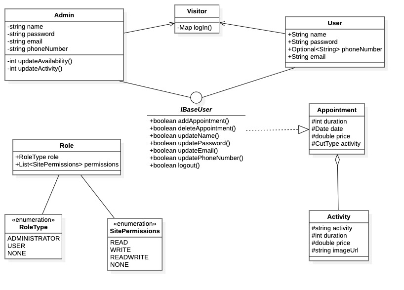
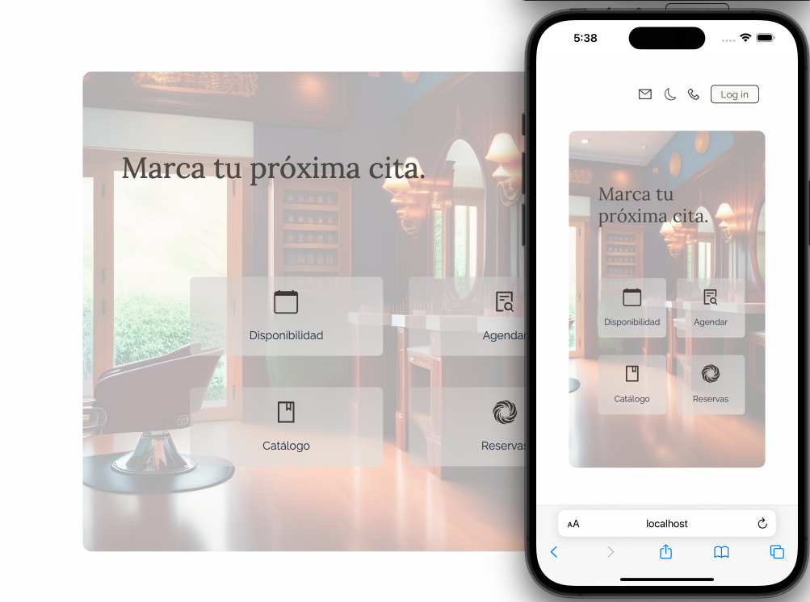
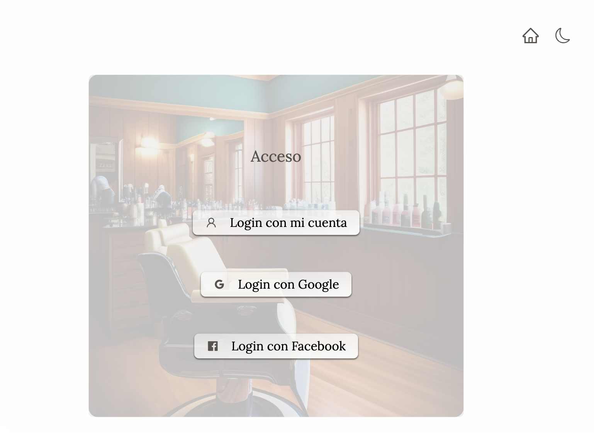
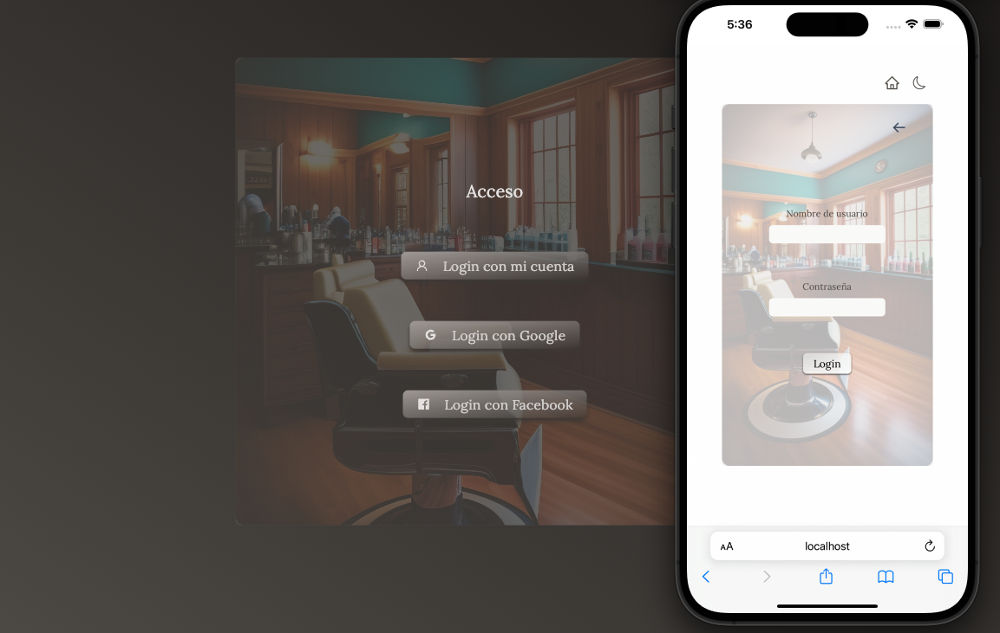
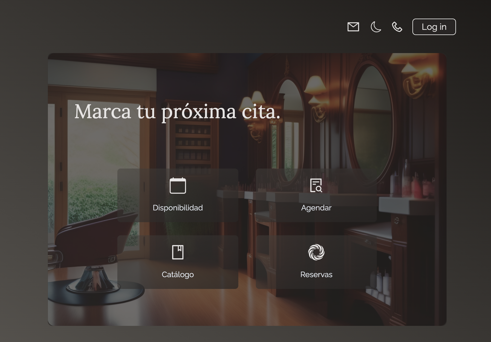

# scheduling-service

Ironhack backend development bootcamp final project.

Backend: SpringBoot, SpringSecurity, OAuth2, JPA, JUnit, MySql. 
Frontend: Typescript, React, TailwindCss.

Demo:
<video src="./other/demo.mov">

Class Diagram:

Overview:

